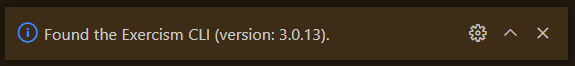

# exercism-cli

Integrate the Exercism CLI with VS Code

## Features

- Install the CLI
- Configure the CLI
- Pick / start a track
- Upgrade the CLI

## Requirements

Your system must be supported by the CLI.

- If the Exercism CLI is already installed, it's version must be >= 3, < 4.
- If you change the workspace location, make sure that it still has `Exercism` in its name.

## How to use ?

After installing the extension, the wizard should open automatically. If it does
not, open the **Command Palette** (`View > Command Palette`) and write: `Get Started`. Pick **Exercism setup** from the list.

### Installing the CLI

On the walkthrough page, follow each step, starting with installing the CLI.

> You also want to press this button even if you have already installed the CLI.

#### Not yet installed

In case the CLI is not found, it will attempt to open the instructions to walk you through the installation process.

#### Already installed

In case the CLI is found on your computer, it will tell you it was found and which version is found. If the version is incompatible it will suggest you update the CLI using this extension.

### Configuring the CLI

When the CLI has been found, it can be configured.

> You also want to press this button even if you have already configured the CLI.

#### Not yet configured

In case the CLI is not yet configured, follow the instructions. Open the settings page and copy your CLI token. Then, click the button again, and enter the CLI token. This is necessary to allow the CLI to communicate with Exercism using your credentials in a secure way.

#### Already configured

In case the CLI is already configured, you can change its settings or leave it as is.

> If you **change** the workspace, **make sure** the directory structure still includes a folder `Exercism`, or this extension will not work properly.

### Get started!

Finally, pick a track (new, or one you've already started). You can pick any track that's available on Exercism, and this list updates automatically.

### Submitting your solution

If you've opened a solution file, in your Exercism workspace, you can use the **Command Palette** to attempt to automatically submit your solution. Do this by typing **submit** after opening the **Command Palette** (`View > Command Palette`),
and pick the **Submit your solution** option.

It will attempt to automatically submit the correct files to Excercism.

See your solution online to start mentoring, see automated analysis, publish it, or continue.

## Extension Settings

This extension doesn't (yet) add any settings.

## Known Issues

None at the moment.

## Release Notes

### 0.1.0

Initial release of the extension
